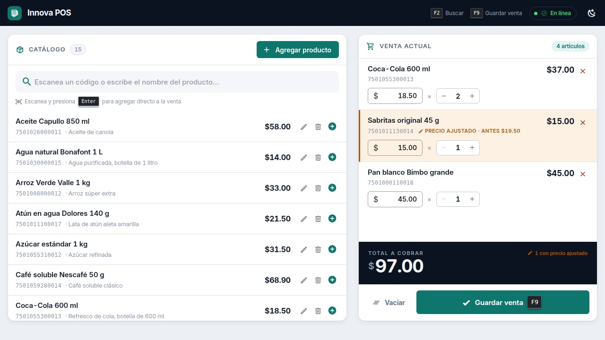

# Innova POS — Punto de venta básico

Aplicación web de una sola pantalla para administrar productos y registrar ventas.
Incluye frontend, backend y persistencia en base de datos relacional.

> Esta es la rama **`ProductionEnv`**, con los dos entregables integrados.

---

## Índice

- [Funcionalidades](#funcionalidades)
- [Interfaz](#interfaz)
- [Stack](#stack)
- [Puesta en marcha](#puesta-en-marcha)
- [Datos iniciales](#datos-iniciales)
- [Despliegue](#despliegue)
- [Modelo de datos](#modelo-de-datos)
- [API](#api)
- [Pruebas](#pruebas)
- [Estructura del repositorio](#estructura-del-repositorio)
- [Comandos disponibles](#comandos-disponibles)
- [Estrategia de ramas](#estrategia-de-ramas)
- [Decisiones de diseño](#decisiones-de-diseño)

---

## Funcionalidades

**Administración de productos**
Alta desde un botón visible en la pantalla principal, mediante un diálogo con validación
en cliente y servidor. Cada producto tiene nombre, precio y código de barras (obligatorios),
más descripción y estado. Se pueden editar y dar de baja.

**Búsqueda**
Un único campo busca simultáneamente por **nombre** y por **código de barras**, sin
distinguir mayúsculas y con resultados en vivo. La coincidencia exacta de código de barras
aparece siempre primero, y al presionar Enter se agrega directo a la venta: el flujo natural
de una pistola lectora.

**Registro de venta**
Panel con los productos agregados mostrando nombre y precio utilizado. Cada renglón permite
**quitarlo de la venta**, **editar su precio** dentro de la venta y ajustar la cantidad. El
**total acumulado** se actualiza en vivo y la venta se guarda en la base de datos con su
detalle completo.

**Persistencia**
Tres tablas relacionadas: `products`, `sales` y `sale_items`. El detalle guarda una copia
del producto al momento de venderse, de modo que editar el catálogo después nunca altera
una venta ya registrada.

---

## Interfaz



Dirección visual **"Terminal de trabajo"**: el total ocupa una losa oscura sin competencia
visual, el ámbar queda reservado para señalar precios ajustados dentro de la venta, y el
flujo completo se opera con teclado (`F2` buscar · `Enter` agregar · `F9` guardar). Incluye
modo oscuro. El detalle de las decisiones está en **[`docs/DESIGN.md`](docs/DESIGN.md)**.

---

## Stack

| Capa | Tecnología |
|------|-----------|
| Backend | Node.js 18+ · Express 4 · Sequelize 6 |
| Frontend | Vue.js 2.7 · Vuetify 2.7 · Axios · Vite |
| Base de datos | PostgreSQL 16 |
| Pruebas | Jest + Supertest (backend) · Vitest + Vue Test Utils (frontend) |
| Calidad | ESLint + Prettier · GitHub Actions |

---

## Puesta en marcha

### Todo con Docker (recomendado)

Único requisito: **Docker y Docker Compose**. No hace falta Node instalado ni
conexión a ninguna base remota.

```bash
docker compose up --build
```

Levanta los tres servicios, aplica las migraciones y siembra los datos de
demostración en el primer arranque. Al terminar:

| | |
|---|---|
| Aplicación | <http://localhost:8080> |
| API | <http://localhost:3000/api> |
| PostgreSQL | `localhost:5432` |

Se sirve ya con catálogo, usuarios e historial: **15 productos, 3 usuarios y 30
días de ventas simuladas**. Las credenciales aparecen en la propia pantalla de
acceso; basta pulsar una para entrar.

| Usuario | Contraseña | Rol |
|---|---|---|
| `admin` | `Admin.Innova2026` | Administrador |
| `supervisor` | `Super.Innova2026` | Supervisor |
| `cajero` | `Cajero.Innova2026` | Cajero |

Los puertos se pueden cambiar si alguno está ocupado:

```bash
API_PORT=3100 WEB_PORT=8081 docker compose up --build
```

Reiniciar no duplica nada: las semillas quedan registradas y solo se aplican una
vez. Para empezar de cero, `docker compose down -v` borra el volumen de datos.
Con `SEED_DEMO_DATA=false` la base arranca vacía, solo con el administrador.

### Con Node en local (para desarrollar)

Recarga en caliente y ejecución fuera de contenedores. Necesita **Node.js 18 o
superior**.

```bash
# 1. Solo la base de datos
docker compose up -d db

# 2. Backend  (terminal 1)
cd backend
cp .env.example .env
npm install
npm run db:setup          # crea la base, migra y siembra los datos de demostración
npm run dev               # http://localhost:3000/api

# 3. Frontend (terminal 2)
cd frontend
npm install
npm run dev               # http://localhost:5173
```

Abre <http://localhost:5173>. La barra superior indica si la API responde.

Verificación rápida:

```bash
curl http://localhost:3000/api/health
```

### Sin Docker

Con PostgreSQL ya instalado, crea la base y ajusta `backend/.env`. Puedes aplicar el
esquema directamente en lugar de migrar:

```bash
createdb innova_pos
psql -d innova_pos -f database/schema.sql
```

### Variables de entorno

Documentadas en `backend/.env.example` y `frontend/.env.example`. Los valores por
defecto coinciden con los del `docker-compose.yml`, así que normalmente basta con
copiarlos tal cual.

---

## Datos iniciales

Hay dos juegos de semillas, y **no son intercambiables**.

### Demostración — `npm run db:seed`

Lo que carga el entorno local: 15 productos, 3 usuarios con contraseñas conocidas
y 30 días de ventas simuladas con su bitácora. Sirve para evaluar el sistema con
las pantallas llenas en lugar de vacías.

El historial se genera de forma determinista (misma semilla, mismo resultado) con
una curva de dos picos, sesgo de fin de semana y distribución desigual entre
productos, para parecerse a una tienda real y no a números al azar.

Estas semillas **se niegan a ejecutarse con `NODE_ENV=production`**: insertarían
historial falso que descuadraría los reportes del negocio y crearían cuentas cuya
contraseña está publicada en este repositorio.

### Producción — `npm run db:seed:prod`

Crea **un solo administrador** y nada más. Sin catálogo, sin ventas, sin bitácora:
esos datos los genera el negocio.

La contraseña nunca se escribe en el repositorio. Se toma de
`INITIAL_ADMIN_PASSWORD` o, si no está definida, se genera al azar y se imprime
una única vez en la consola:

```
┌───────────────────────────────────────────────────────────┐
│  ADMINISTRADOR INICIAL CREADO                             │
├───────────────────────────────────────────────────────────┤
│  Usuario:     admin                                       │
│  Contraseña:  JEx75-Gcf89-a4KyS-wG6VY                     │
│                                                           │
│  Anótala ahora: no se vuelve a mostrar y no queda         │
│  guardada en ningún archivo. Cámbiala al entrar.          │
└───────────────────────────────────────────────────────────┘
```

Volver a ejecutarlo no crea un segundo administrador ni restablece la contraseña
del que ya está en uso.

Los atajos de acceso con credenciales que aparecen en el login tampoco se
compilan en un build de producción: la condición se resuelve al compilar y el
bundle publicado no contiene ninguna contraseña.

---

## Despliegue

El repositorio trae la configuración para publicar frontend, API y base por
separado.

| Pieza | Servicio | Configuración |
|---|---|---|
| Frontend | Firebase Hosting | `frontend/firebase.json` |
| API | Render | `render.yaml` |
| Base de datos | Supabase | `DATABASE_URL` |

**Base de datos.** Copia la cadena del *Session pooler* de Supabase (puerto
5432) en `DATABASE_URL`. El *Transaction pooler* (6543) no admite sentencias
preparadas y rompe las migraciones. Cuando esa variable está presente tiene
prioridad sobre `DB_HOST`/`DB_NAME`/etc. y activa TLS automáticamente.

**API.** El blueprint `render.yaml` aplica las migraciones en el paso de build,
antes de que la instancia reciba tráfico. Quedan dos variables por completar en
el panel: `DATABASE_URL` y `CORS_ORIGIN`. El `JWT_SECRET` lo genera Render solo.
Después, una vez: `npm run db:seed:prod`.

**Frontend.** `VITE_API_BASE_URL` es obligatoria y se resuelve al compilar, no en
tiempo de ejecución: en un build estático no existe el proxy del servidor de
desarrollo y el navegador llama a la API directamente.

```bash
cd frontend
VITE_API_BASE_URL=https://tu-api.onrender.com/api npm run build
firebase deploy --only hosting
```

Firebase publica el mismo sitio en dos dominios (`.web.app` y
`.firebaseapp.com`), así que `CORS_ORIGIN` admite lista separada por comas y
deben ir los dos: declarar solo uno deja el otro rechazado por CORS, con un
error que en el navegador se lee como "la API no responde".

---

## Modelo de datos

```
┌─────────────────────┐         ┌─────────────────────┐         ┌─────────────────────┐
│      products       │         │     sale_items      │         │        sales        │
├─────────────────────┤         ├─────────────────────┤         ├─────────────────────┤
│ id            PK    │◄────────│ product_id   FK ∅   │────────►│ id            PK    │
│ name                │  SET    │ sale_id      FK     │ CASCADE │ folio       UNIQUE  │
│ barcode      UNIQUE │  NULL   │                     │         │ subtotal  DEC(10,2) │
│ price      DEC(10,2)│         │ product_name        │         │ total     DEC(10,2) │
│ description         │         │ product_barcode     │         │ status              │
│ is_active           │         │ unit_price DEC(10,2)│         │ item_count          │
│ deleted_at          │         │ quantity            │         │ sold_at             │
└─────────────────────┘         │ line_total DEC(10,2)│         └─────────────────────┘
                                └─────────────────────┘
                                  ▲ copia del producto
                                    al momento de la venta
```

**Lo esencial del diseño está en `sale_items`.** Además de referenciar al producto, guarda
una copia de su nombre, su código de barras y el precio cobrado. Sin esa copia, editar el
precio de un producto reescribiría el histórico de todas las ventas anteriores. Y como el
requisito permite editar el precio *dentro de la venta*, `unit_price` tiene que ser un dato
propio del renglón, no una lectura de la tabla de productos.

De ahí se derivan las reglas de integridad:

- `sale_id` es **CASCADE**: un renglón no tiene sentido sin su venta.
- `product_id` es **nullable con SET NULL**: si el producto desaparece del catálogo, la
  venta sigue siendo legible.
- Los productos se dan de baja de forma **lógica** (`deleted_at`), nunca se eliminan.

---

## API

Referencia completa con ejemplos ejecutables en **[`docs/API.md`](docs/API.md)**.

| Método | Ruta | Descripción |
|--------|------|-------------|
| `GET` | `/api/health` | Estado del servicio |
| `GET` | `/api/products` | Listar y buscar (`?q=` por nombre o código de barras) |
| `GET` | `/api/products/:id` | Detalle |
| `GET` | `/api/products/barcode/:barcode` | Consulta por código de barras exacto |
| `POST` | `/api/products` | Alta |
| `PUT` | `/api/products/:id` | Edición |
| `DELETE` | `/api/products/:id` | Baja lógica |
| `POST` | `/api/sales` | Registrar venta con su detalle |
| `GET` | `/api/sales` | Histórico paginado |
| `GET` | `/api/sales/:id` | Venta con todos sus renglones |

Los importes viajan siempre como string con dos decimales (`"18.50"`), nunca como número.

---

## Pruebas

```bash
cd backend  && npm test     # 67 pruebas — Jest + Supertest sobre PostgreSQL real
cd frontend && npm test     # 56 pruebas — Vitest + Vue Test Utils
```

Las pruebas del backend corren contra una base PostgreSQL de verdad, no contra un motor
en memoria: solo así se valida el comportamiento real de `DECIMAL`, de las restricciones
únicas y de las transacciones. La base de test se crea y migra sola.

Entre lo cubierto: cálculo de totales en el servidor, prevalencia del precio editado sobre
el de catálogo, ausencia de error de punto flotante al sumar cien renglones, folios
correlativos, reversión completa de la transacción ante un fallo al insertar el detalle, y
que una venta ya registrada no se altere al cambiar o dar de baja el producto.

---

## Estructura del repositorio

```
innova-pos/
├── backend/                 API REST
│   ├── src/
│   │   ├── config/          entorno y configuración de Sequelize
│   │   ├── models/          modelos y asociaciones
│   │   ├── services/        lógica de negocio y transacciones
│   │   ├── controllers/     adaptadores HTTP
│   │   ├── routes/          definición de endpoints
│   │   ├── validators/      reglas de express-validator
│   │   ├── middlewares/     manejo de errores y validación
│   │   ├── database/        migraciones y seeders
│   │   └── utils/           importes, errores, helpers
│   └── tests/               integración y unitarias
├── frontend/                SPA Vue 2 + Vuetify
│   └── src/
│       ├── components/      ProductCatalog · ProductFormDialog · SalePanel
│       ├── services/        cliente Axios y servicios de API
│       ├── plugins/         inicialización de Vuetify
│       └── utils/           aritmética en centavos y formato
├── database/schema.sql      esquema completo en SQL plano
├── docs/API.md              referencia de la API
├── docs/DESIGN.md           sistema de diseño y decisiones visuales
└── docker-compose.yml       PostgreSQL para desarrollo
```

---

## Comandos disponibles

**Backend** (`cd backend`)

| Comando | Descripción |
|---------|-------------|
| `npm run dev` | Servidor con recarga automática |
| `npm start` | Servidor en modo producción |
| `npm run db:setup` | Crear base + migrar + sembrar datos de demostración |
| `npm run db:setup:prod` | Migrar + crear solo el administrador inicial |
| `npm run db:migrate` | Aplicar migraciones pendientes |
| `npm run db:seed` | Sembrar los datos de demostración |
| `npm run db:seed:prod` | Crear el administrador inicial (producción) |
| `npm run db:reset` | Revertir, migrar y sembrar de nuevo |
| `npm test` | Suite completa |
| `npm run test:coverage` | Suite con cobertura |
| `npm run lint` | ESLint |

**Frontend** (`cd frontend`)

| Comando | Descripción |
|---------|-------------|
| `npm run dev` | Servidor de desarrollo |
| `npm run build` | Build de producción en `dist/` |
| `npm test` | Pruebas de componentes |
| `npm run lint` | ESLint |

---

## Estrategia de ramas

| Rama | Contenido |
|------|-----------|
| `main` | Scaffold, infraestructura y utilidades compartidas |
| `feature/products` | **Entregable 1** — administración y búsqueda de productos |
| `feature/sales` | **Entregable 2** — registro y persistencia de ventas |
| `ProductionEnv` | Versión final con ambos entregables integrados |

`feature/sales` nace de `feature/products` porque el carrito no puede existir sin el
dominio de productos: ramificar en secuencia refleja esa dependencia real. Ambos se
integran en `ProductionEnv` con merges `--no-ff` separados, de modo que la frontera entre
entregables queda visible en el historial:

```bash
git log --graph --oneline --all
```

---

## Decisiones de diseño

**Importes en `DECIMAL`, aritmética en centavos.**
El punto flotante binario no representa exactamente valores como 19.99 y acumula error al
sumar. Los precios se almacenan como `DECIMAL(10,2)`, viajan por la API como string y se
suman en centavos enteros, tanto en el servidor como en el navegador. El total que el
cajero ve en pantalla coincide dígito a dígito con el que se persiste.

**Los totales se calculan en el servidor.**
Del cliente solo se acepta qué producto, a qué precio se cobró y cuántas unidades. Un total
enviado desde el navegador nunca se guarda.

**Registro transaccional.**
La venta y su detalle se insertan en una única transacción: si falla cualquier renglón, la
cabecera tampoco queda guardada. Una venta a medias es peor que ninguna venta.

**Folio desde una secuencia de PostgreSQL.**
Numerar con `COUNT(*)` haría que dos cajas vendiendo a la vez obtuvieran el mismo folio;
`nextval` es atómico incluso dentro de transacciones.

**Vite en lugar de Vue CLI.**
Vue CLI depende de webpack 4, que falla con Node ≥ 17 por el cambio de proveedor
criptográfico de OpenSSL y obligaría a arrancar con `--openssl-legacy-provider`.
`@vitejs/plugin-vue2` compila exactamente el mismo Vue 2 sin ese problema.

**Errores centralizados.**
Los servicios lanzan errores de dominio y un único middleware los traduce a HTTP,
incluyendo los propios de Sequelize. El cliente recibe siempre la misma forma de respuesta
y los errores por campo se pintan en su input correspondiente.

---

## Alcance

Conforme a lo solicitado, **no** se implementaron: impresión de tickets, generación de
documentos, reportes, inventarios, control de caja, métodos de pago ni autenticación de
usuarios.

---

## Licencia

Proyecto desarrollado como prueba técnica.
