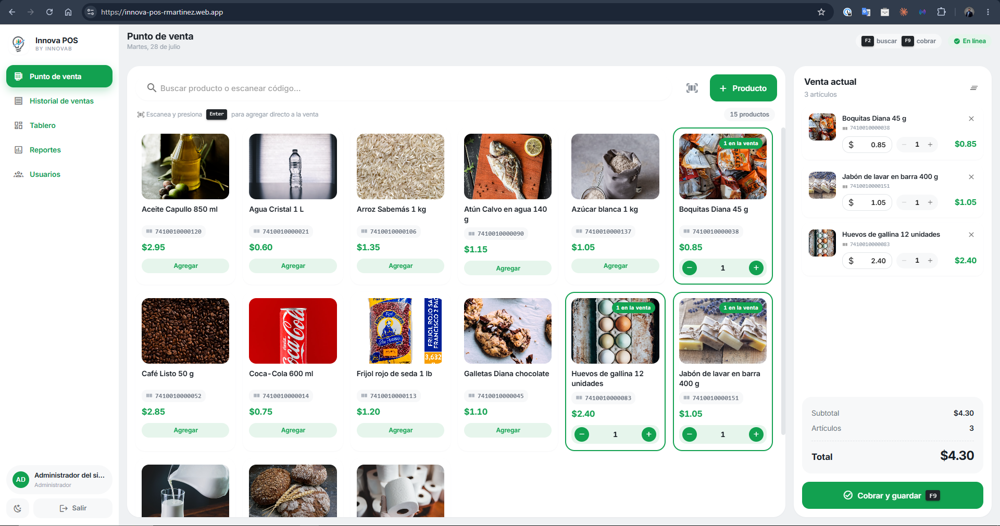
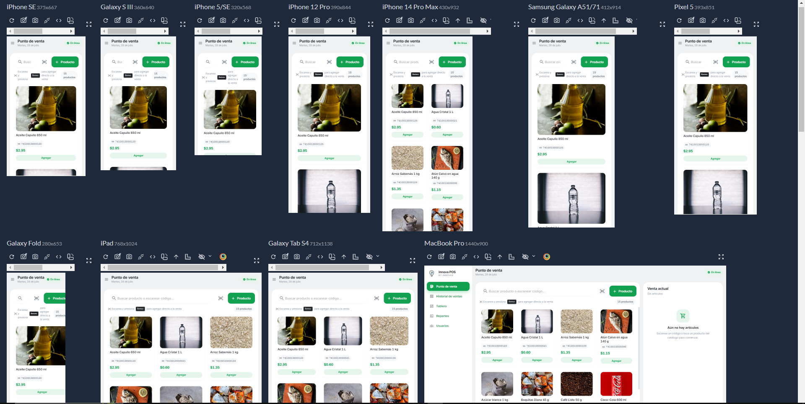

# Innova POS — Punto de venta

Sistema de punto de venta para una tienda de barrio: catálogo de productos,
registro de ventas, historial con ticket, tablero, reportería y bitácora de
auditoría. Con autenticación por roles, instalable como aplicación y en hora de
El Salvador.

> Esta es la rama **`ProductionEnv`**, con todos los entregables integrados.

---

## Cómo levantar el proyecto

**Un solo comando.** Requiere únicamente Docker y Docker Compose — no hace falta
tener Node instalado ni conectarse a ninguna base de datos remota.

```bash
git clone https://github.com/RafaDev-IT/innova-pos.git
cd innova-pos
docker compose up --build
```

Eso levanta base de datos, API y frontend, aplica las migraciones y siembra los
datos de demostración. Cuando termine:

| | |
|---|---|
| **Aplicación** | <http://localhost:8080> |
| API | <http://localhost:3000/api> |
| PostgreSQL | `localhost:5432` |

Entra con cualquiera de estas cuentas —aparecen en la propia pantalla de acceso,
basta pulsar una—:

| Usuario | Contraseña | Rol |
|---|---|---|
| `admin` | `Admin.Innova2026` | Administrador |
| `supervisor` | `Super.Innova2026` | Supervisor |
| `cajero` | `Cajero.Innova2026` | Cajero |

El sistema arranca con **15 productos, 3 usuarios y 30 días de historial**
(600 ventas), de modo que el tablero y los reportes tengan algo que mostrar
desde el primer momento.

Si algún puerto está ocupado:

```bash
API_PORT=3100 WEB_PORT=8081 docker compose up --build
```

Para empezar de cero, `docker compose down -v` borra el volumen de datos.

> ¿Prefieres ejecutarlo con Node, sin contenedores, o necesitas recarga en
> caliente para desarrollar? Ver **[Puesta en marcha](#puesta-en-marcha)**.

---

## Índice

- [Cómo levantar el proyecto](#cómo-levantar-el-proyecto)
- [Funcionalidades](#funcionalidades)
- [Interfaz](#interfaz)
- [Stack](#stack)
- [Puesta en marcha](#puesta-en-marcha)
- [Datos iniciales](#datos-iniciales)
- [Despliegue](#despliegue)
- [Aplicación instalable y diseño adaptable](#aplicación-instalable-y-diseño-adaptable)
- [Modelo de datos](#modelo-de-datos)
- [API](#api)
- [Pruebas](#pruebas)
- [Documentación](#documentación)
- [Estructura del repositorio](#estructura-del-repositorio)
- [Comandos disponibles](#comandos-disponibles)
- [Estrategia de ramas](#estrategia-de-ramas)
- [Decisiones de diseño](#decisiones-de-diseño)

---

## Funcionalidades

**Administración de productos**
Alta desde un botón visible en la pantalla principal, mediante un diálogo con validación
en cliente y servidor. Cada producto tiene nombre, precio y código de barras (obligatorios),
más descripción y estado. Se pueden editar y dar de baja.

**Búsqueda**
Un único campo busca simultáneamente por **nombre** y por **código de barras**, sin
distinguir mayúsculas y con resultados en vivo. La coincidencia exacta de código de barras
aparece siempre primero, y al presionar Enter se agrega directo a la venta: el flujo natural
de una pistola lectora.

**Registro de venta**
Panel con los productos agregados mostrando nombre y precio utilizado. Cada renglón permite
**quitarlo de la venta**, **editar su precio** dentro de la venta y ajustar la cantidad. El
**total acumulado** se actualiza en vivo y la venta se guarda en la base de datos con su
detalle completo.

**Persistencia**
El detalle de cada venta guarda una copia del producto al momento de venderse, de
modo que editar el catálogo después nunca altera una venta ya registrada.

### Más allá de lo solicitado

Con el visto bueno del cliente se añadieron los módulos que un punto de venta
necesita para ser usable de verdad:

| Módulo | Qué resuelve |
|---|---|
| **Acceso y roles** | Tres perfiles —administrador, supervisor, cajero— con permisos aplicados en el servidor. Al entrar, cada usuario ve qué puede hacer y qué no |
| **Tablero** | Indicadores del día, ventas por hora, más vendidos y actividad reciente de cada usuario |
| **Reportería** | Análisis por período, desempeño por cajero, seguimiento de precios ajustados y exportación a CSV |
| **Historial de ventas** | Búsqueda por folio, fecha, cajero o estado; ticket completo y anulación con motivo, que se descuenta al instante del tablero y los reportes |
| **Bitácora de auditoría** | Registro inmutable de quién hizo qué |
| **Códigos de barras** | EAN-13 generados con dígito verificador, dibujados en pantalla y legibles por cámara |
| **Aplicación instalable** | Se añade a la pantalla de inicio y funciona sin conexión para consultar |

Todo el sistema opera en **hora de El Salvador**: un reporte por hora responde a
qué hora vendió la tienda, no a qué hora fue en Greenwich.

---

## Interfaz



Claro, aireado y minimalista: tarjetas blancas sobre un lienzo gris muy claro,
radios generosos, sombras casi imperceptibles y verde como único acento. La
separación se consigue con el contraste entre lienzo y superficie, no con
líneas.

El catálogo con foto queda a la izquierda y la venta en curso a la derecha. Todo
el flujo se opera con teclado —`F2` buscar, `Enter` agregar, `F9` cobrar—, porque
en una caja el ratón sobra. Cada renglón permite ajustar el precio dentro de la
venta y quitarse; el precio ajustado queda marcado y aparece después en un
reporte propio, porque es dinero cobrado por debajo del catálogo.


Incluye modo oscuro, con paleta propia y no un aclarado automático del tema
claro. El predeterminado es el claro. El detalle de las decisiones visuales está
en **[`docs/DESIGN.md`](docs/DESIGN.md)**.

### En cualquier pantalla



Probado sobre once dispositivos, desde un Galaxy Fold plegado (280 px) hasta un
MacBook Pro, y verificado midiendo el desbordamiento horizontal en 11 anchos por
5 pantallas.

---

## Stack

| Capa | Tecnología |
|------|-----------|
| Backend | Node.js 18+ · Express 4 · Sequelize 6 |
| Frontend | Vue.js 2.7 · Vuetify 2.7 · Axios · Vite |
| Base de datos | PostgreSQL 16 |
| Pruebas | Jest + Supertest (backend) · Vitest + Vue Test Utils (frontend) |
| Calidad | ESLint + Prettier · GitHub Actions |
| Entorno | Docker Compose — base, API y frontend en un comando |
| Despliegue | Firebase Hosting · Render · Supabase |

---

## Puesta en marcha

La forma recomendada —un solo comando con Docker— está al principio de este
documento: **[Cómo levantar el proyecto](#cómo-levantar-el-proyecto)**. Aquí
quedan las alternativas.

### Ajustes del entorno con Docker

Reiniciar no duplica nada: las semillas quedan registradas y solo se aplican una
vez. Con `SEED_DEMO_DATA=false` la base arranca vacía, únicamente con el
administrador inicial.

### Con Node en local (para desarrollar)

Recarga en caliente y ejecución fuera de contenedores. Necesita **Node.js 18 o
superior**.

```bash
# 1. Solo la base de datos
docker compose up -d db

# 2. Backend  (terminal 1)
cd backend
cp .env.example .env
npm install
npm run db:setup          # crea la base, migra y siembra los datos de demostración
npm run dev               # http://localhost:3000/api

# 3. Frontend (terminal 2)
cd frontend
npm install
npm run dev               # http://localhost:5173
```

Abre <http://localhost:5173>. La barra superior indica si la API responde.

Verificación rápida:

```bash
curl http://localhost:3000/api/health
```

### Sin Docker

Con PostgreSQL ya instalado, crea la base y ajusta `backend/.env`. Puedes aplicar el
esquema directamente en lugar de migrar:

```bash
createdb innova_pos
psql -d innova_pos -f database/schema.sql
```

### Variables de entorno

Documentadas en `backend/.env.example` y `frontend/.env.example`. Los valores por
defecto coinciden con los del `docker-compose.yml`, así que normalmente basta con
copiarlos tal cual.

---

## Datos iniciales

Hay dos juegos de semillas, y **no son intercambiables**.

### Demostración — `npm run db:seed`

Lo que carga el entorno local: 15 productos, 3 usuarios con contraseñas conocidas
y 30 días de ventas simuladas con su bitácora. Sirve para evaluar el sistema con
las pantallas llenas en lugar de vacías.

El historial se genera de forma determinista (misma semilla, mismo resultado) con
una curva de dos picos, sesgo de fin de semana y distribución desigual entre
productos, para parecerse a una tienda real y no a números al azar.

Estas semillas **se niegan a ejecutarse con `NODE_ENV=production`**: insertarían
historial falso que descuadraría los reportes del negocio y crearían cuentas cuya
contraseña está publicada en este repositorio.

### Producción — `npm run db:seed:prod`

Crea **un solo administrador** y nada más. Sin catálogo, sin ventas, sin bitácora:
esos datos los genera el negocio.

La contraseña nunca se escribe en el repositorio. Se toma de
`INITIAL_ADMIN_PASSWORD` o, si no está definida, se genera al azar y se imprime
una única vez en la consola:

```
┌───────────────────────────────────────────────────────────┐
│  ADMINISTRADOR INICIAL CREADO                             │
├───────────────────────────────────────────────────────────┤
│  Usuario:     admin                                       │
│  Contraseña:  JEx75-Gcf89-a4KyS-wG6VY                     │
│                                                           │
│  Anótala ahora: no se vuelve a mostrar y no queda         │
│  guardada en ningún archivo. Cámbiala al entrar.          │
└───────────────────────────────────────────────────────────┘
```

Volver a ejecutarlo no crea un segundo administrador ni restablece la contraseña
del que ya está en uso.

Los atajos de acceso con credenciales que aparecen en el login tampoco se
compilan en un build de producción: la condición se resuelve al compilar y el
bundle publicado no contiene ninguna contraseña.

---

## Despliegue

El repositorio trae la configuración para publicar frontend, API y base por
separado.

| Pieza | Servicio | Configuración |
|---|---|---|
| Frontend | Firebase Hosting | `frontend/firebase.json` |
| API | Render | `render.yaml` |
| Base de datos | Supabase | `DATABASE_URL` |

**Base de datos.** Basta con definir `DATABASE_URL`: cuando está presente tiene
prioridad sobre `DB_HOST`/`DB_NAME`/etc., activa TLS automáticamente y la usan
por igual la API y las migraciones. Comentarla vuelve a la base local sin ningún
otro cambio.

Supabase ofrece tres cadenas en *Project Settings → Database* y solo una sirve:

| Opción | |
|---|---|
| **Session pooler** (5432) | ✔ La correcta. Usuario `postgres.<ref>`, host `aws-N-<región>.pooler.supabase.com` |
| Direct connection | ✖ `db.<ref>.supabase.co` solo resuelve a IPv6, y el plan gratuito de Render no tiene salida IPv6: falla con `ENETUNREACH` |
| Transaction pooler (6543) | ✖ No admite sentencias preparadas y rompe las migraciones |

```bash
cd backend
DATABASE_URL='postgresql://postgres.<ref>:<contraseña>@aws-N-<región>.pooler.supabase.com:5432/postgres' \
NODE_ENV=production npm run db:migrate
# …y una sola vez, para crear el administrador:
DATABASE_URL='…' NODE_ENV=production npm run db:seed:prod
```

**API.** El blueprint `render.yaml` aplica las migraciones en el paso de build,
antes de que la instancia reciba tráfico. Quedan dos variables por completar en
el panel: `DATABASE_URL` y `CORS_ORIGIN`. El `JWT_SECRET` lo genera Render solo.
Después, una vez: `npm run db:seed:prod`.

**Frontend.** `VITE_API_BASE_URL` es obligatoria y se resuelve al compilar, no en
tiempo de ejecución: en un build estático no existe el proxy del servidor de
desarrollo y el navegador llama a la API directamente.

La URL vive en `frontend/.env.production`, que sí se versiona: no es un secreto
y evita tener que recordarla en cada compilación. Olvidarla no da error de
compilación —la aplicación llamaría a `/api` del propio dominio de Firebase— y
el fallo solo aparecería al intentar iniciar sesión.

```bash
cd frontend
npm run build
firebase deploy --only hosting
```

Firebase publica el mismo sitio en dos dominios (`.web.app` y
`.firebaseapp.com`), así que `CORS_ORIGIN` admite lista separada por comas y
deben ir los dos: declarar solo uno deja el otro rechazado por CORS, con un
error que en el navegador se lee como "la API no responde".

---

## Aplicación instalable y diseño adaptable

### PWA

La aplicación se puede instalar como una aplicación más del dispositivo, sin
pasar por ninguna tienda. En Chrome y Edge aparece un icono de instalación en la
barra de direcciones; en iOS, *Compartir → Añadir a pantalla de inicio*.

Instalada abre a pantalla completa, sin barra del navegador, con su icono y su
nombre propios.

| Pieza | Dónde |
|---|---|
| Manifiesto | `public/manifest.webmanifest` |
| Service worker | `public/sw.js` |
| Iconos | `public/icons/` (192, 256, 384, 512 y dos *maskable*) |
| Registro | `src/registerServiceWorker.js` |

**Sin conexión** la aplicación sigue abriendo: el armazón y los recursos
compilados se sirven de la copia local, la sesión iniciada se conserva y la
barra superior avisa *Sin conexión*.

Lo que **no** hace, deliberadamente: no guarda ventas para enviarlas después.
En un punto de venta, una venta "registrada" que en realidad se quedó en el
navegador es dinero perdido y descuadre de caja. Las escrituras van siempre a la
red o fallan de forma visible. Las lecturas de la API van primero a la red y
solo recurren a la copia si no hay conexión.

El service worker tampoco se activa en caliente: una versión nueva espera a que
se cierren las pestañas abiertas. Reemplazar el código a mitad de una venta es
justamente lo que no debe pasar en una caja.

### Adaptación a pantallas

Comprobado midiendo el desbordamiento horizontal en **11 anchos × 5 pantallas**
(320, 360, 390, 414, 540, 768, 820, 1024, 1280, 1440 y 1920 px): sin desbordes.

| Rango | Comportamiento |
|---|---|
| < 600 px | Menú lateral colapsable, filtros apilados, campos sin ancho mínimo |
| 600–1279 px | Rejillas de una columna, menú lateral fijo |
| ≥ 1280 px | Dos columnas en tablero y reportes |

Decisiones que resuelven los fallos más habituales:

- **Las tablas se desplazan dentro de su contenedor** (`.table-scroll`), nunca
  empujando la página. Si el documento entero se desplaza, la barra lateral y la
  cabecera se descuadran con él.
- **Las rejillas usan `minmax(0, 1fr)`** y no `1fr`. `1fr` equivale a
  `minmax(auto, 1fr)`, y un mínimo automático deja que el contenido estire la
  columna: es el desbordamiento clásico de CSS Grid.
- **Los campos llevan 16 px en móvil.** Safari en iOS amplía la página al
  enfocar un campo más pequeño y luego no la devuelve a su sitio.
- **Áreas táctiles de 44 px**, el umbral por debajo del cual el dedo falla de
  forma medible (WCAG 2.5.5).
- **Márgenes seguros** con `env(safe-area-inset-*)`, para que la barra de gestos
  de un iPhone no tape el total ni el botón de cobrar.

El foco de teclado es visible en todos los controles (contorno verde de 2 px), y
las gráficas ofrecen su alternativa en tabla.

### Limitaciones conocidas

- **Sin ventas sin conexión.** Es una decisión, no una carencia: ver arriba.
- **iOS no admite instalación desde un navegador que no sea Safari**, ni notifica
  la posibilidad de instalar; hay que usar *Añadir a pantalla de inicio* a mano.
- **La regla de área táctil combina `pointer: coarse` y ancho de pantalla.** Lo
  correcto conceptualmente es solo lo primero —importa cómo se apunta, no cuánto
  mide la pantalla—, pero esa condición no se puede verificar de forma
  automatizada en un navegador de escritorio, y se prefirió una regla
  comprobable.
- **La escala de grises de las gráficas no se ha probado con impresión en
  blanco y negro.**
- **El escáner de cámara** usa `BarcodeDetector` cuando existe y recurre a una
  biblioteca en su defecto; en navegadores muy antiguos no funciona.

---

## Modelo de datos


Cinco tablas de negocio, más las dos que Sequelize usa para llevar el control de
migraciones y semillas.

| Tabla | Contiene |
|---|---|
| `products` | Catálogo. Baja lógica con `deleted_at`, nunca se elimina |
| `sales` | Cabecera: folio, totales, estado, cajero y datos de anulación |
| `sale_items` | Renglones de cada venta, con copia del producto |
| `users` | Cuentas, rol y hash de contraseña |
| `audit_log` | Bitácora inmutable de quién hizo qué |

**Lo esencial del diseño está en `sale_items`.** Además de referenciar al producto, guarda
una copia de su nombre, su código de barras y el precio cobrado. Sin esa copia, editar el
precio de un producto reescribiría el histórico de todas las ventas anteriores. Y como el
requisito permite editar el precio *dentro de la venta*, `unit_price` tiene que ser un dato
propio del renglón, no una lectura de la tabla de productos.

De ahí se derivan las reglas de integridad:

| Relación | Regla | Motivo |
|---|---|---|
| `sale_items.sale_id` → `sales` | `CASCADE` | Un renglón no significa nada sin su venta |
| `sale_items.product_id` → `products` | `SET NULL` | Se puede dar de baja un producto sin perder las ventas que lo incluyeron |
| `sales.user_id` → `users` | `SET NULL` | Un empleado que se va no borra el rastro de lo que vendió |
| `audit_log.user_id` → `users` | `SET NULL` | Igual, y con copia del nombre para que la bitácora siga siendo legible |

Los productos se dan de baja de forma **lógica** (`deleted_at`); nunca se
eliminan. Y el folio de la venta sale de una secuencia de PostgreSQL
(`nextval`), no de un `COUNT(*)`: `nextval` es atómico, mientras que contar filas
produce folios duplicados en cuanto dos cajas cobran a la vez.

---

## API

Referencia completa con ejemplos ejecutables en **[`docs/API.md`](docs/API.md)**.

| Método | Ruta | Descripción |
|--------|------|-------------|
| `GET` | `/api/health` | Estado del servicio |
| `GET` | `/api/products` | Listar y buscar (`?q=` por nombre o código de barras) |
| `GET` | `/api/products/:id` | Detalle |
| `GET` | `/api/products/barcode/:barcode` | Consulta por código de barras exacto |
| `POST` | `/api/products` | Alta |
| `PUT` | `/api/products/:id` | Edición |
| `DELETE` | `/api/products/:id` | Baja lógica |
| `POST` | `/api/sales` | Registrar venta con su detalle |
| `GET` | `/api/sales` | Histórico paginado |
| `GET` | `/api/sales/:id` | Venta con todos sus renglones |

Los importes viajan siempre como string con dos decimales (`"18.50"`), nunca como número.

---

## Pruebas

```bash
cd backend  && npm test     # 180 pruebas — Jest + Supertest sobre PostgreSQL real
cd frontend && npm test     # 106 pruebas — Vitest + Vue Test Utils
```

Las pruebas del backend corren contra una base PostgreSQL de verdad, no contra un motor
en memoria: solo así se valida el comportamiento real de `DECIMAL`, de las restricciones
únicas y de las transacciones. La base de test se crea y migra sola.

Entre lo cubierto: cálculo de totales en el servidor, prevalencia del precio editado sobre
el de catálogo, ausencia de error de punto flotante al sumar cien renglones, folios
correlativos, reversión completa de la transacción ante un fallo al insertar el detalle, y
que una venta ya registrada no se altere al cambiar o dar de baja el producto.

También se verifica el permiso de cada endpoint por rol, la conversión de zona
horaria en las agregaciones y **el propio seeder**, ejecutado contra un
`queryInterface` falso para comprobar que todos los códigos de barras que
produce son EAN-13 válidos: la corrección de los datos sembrados se verifica, no
se supone.

La configuración de pruebas **no admite `DATABASE_URL`**, de modo que la suite no
puede truncar tablas en producción aunque la variable esté definida.

---

## Documentación

| Documento | Contenido |
|---|---|
| [`backend/README.md`](backend/README.md) | API: capas, seguridad, cifrado, endpoints, semillas |
| [`frontend/README.md`](frontend/README.md) | Interfaz: sistema de diseño, PWA, adaptación a pantallas |
| [`docs/API.md`](docs/API.md) | Referencia de endpoints con parámetros y respuestas |
| [`docs/DESIGN.md`](docs/DESIGN.md) | Decisiones visuales y validación de la paleta |

---

## Estructura del repositorio

```
innova-pos/
├── backend/                      API REST — ver backend/README.md
│   ├── src/
│   │   ├── config/               entorno, Sequelize y matriz de permisos
│   │   ├── models/               modelos, hooks y asociaciones
│   │   ├── services/             lógica de negocio y transacciones
│   │   ├── controllers/          adaptadores HTTP, sin lógica
│   │   ├── routes/               endpoints y permiso exigido por cada uno
│   │   ├── validators/           reglas de express-validator
│   │   ├── middlewares/          autenticación, permisos, errores
│   │   ├── database/             migrations/ y seeders/
│   │   └── utils/                dinero en centavos, EAN-13, errores
│   ├── tests/                    180 pruebas
│   ├── Dockerfile
│   └── docker-entrypoint.sh      migra y siembra antes de servir
│
├── frontend/                     SPA Vue 2 — ver frontend/README.md
│   ├── public/
│   │   ├── manifest.webmanifest  declaración de la PWA
│   │   ├── sw.js                 service worker
│   │   └── icons/                siete tamaños, dos de ellos maskable
│   ├── src/
│   │   ├── views/                una por ruta, carga perezosa
│   │   ├── components/           incluye charts/ en SVG, sin librería
│   │   ├── services/             cliente HTTP y un servicio por recurso
│   │   ├── store/                session.js — único estado global
│   │   ├── styles/               design-system.css: tokens y clases
│   │   ├── utils/                formato, centavos, EAN-13
│   │   └── plugins/              Vuetify y temas
│   ├── tests/                    106 pruebas
│   ├── Dockerfile                compila con Node, sirve con nginx
│   ├── nginx.conf                reescritura SPA y cabeceras de caché
│   └── firebase.json             hosting
│
├── database/schema.sql           esquema completo en SQL plano
├── docs/
│   ├── API.md                    referencia de endpoints
│   ├── DESIGN.md                 decisiones visuales y paleta
│   └── screenshots/
├── docker-compose.yml            base + API + frontend
└── render.yaml                   despliegue de la API
```

---

## Comandos disponibles

**Backend** (`cd backend`)

| Comando | Descripción |
|---------|-------------|
| `npm run dev` | Servidor con recarga automática |
| `npm start` | Servidor en modo producción |
| `npm run db:setup` | Crear base + migrar + sembrar datos de demostración |
| `npm run db:setup:prod` | Migrar + crear solo el administrador inicial |
| `npm run db:migrate` | Aplicar migraciones pendientes |
| `npm run db:seed` | Sembrar los datos de demostración |
| `npm run db:seed:prod` | Crear el administrador inicial (producción) |
| `npm run db:reset` | Revertir, migrar y sembrar de nuevo |
| `npm test` | Suite completa |
| `npm run test:coverage` | Suite con cobertura |
| `npm run lint` | ESLint |

**Frontend** (`cd frontend`)

| Comando | Descripción |
|---------|-------------|
| `npm run dev` | Servidor de desarrollo |
| `npm run build` | Build de producción en `dist/` |
| `npm test` | Pruebas de componentes |
| `npm run lint` | ESLint |

---

## Estrategia de ramas

**125 commits en 24 ramas**, cada una con un alcance definido e integrada en
`ProductionEnv` mediante un merge `--no-ff`. La frontera entre entregables queda
así visible en el historial:

```bash
git log --graph --oneline --all
```

| Rama | Contenido |
|---|---|
| `main` | Scaffold, infraestructura y utilidades compartidas |
| `feature/products` | **Entregable 1** — administración y búsqueda de productos |
| `feature/sales` | **Entregable 2** — registro y persistencia de ventas |
| `feature/auth` | Usuarios, inicio de sesión, JWT y roles |
| `feature/analytics` · `feature/reports-layout` | Tablero y reportería |
| `feature/sales-history` | Historial, ticket y anulación |
| `feature/audit` | Bitácora |
| `feature/barcode-generator` | EAN-13 y lectura por cámara |
| `feature/redesign` · `feature/ui-v2` · `feature/branding` · `feature/login-split` | Rediseño de la interfaz |
| `feature/input-validation` | Validación de tipos en todos los campos |
| `feature/production-ready` | Separación de semillas y endurecimiento |
| `feature/pwa-responsive` | Aplicación instalable y adaptación a pantallas |
| `fix/*` | Correcciones acotadas: conectividad, códigos sembrados, build de Render, desplazamiento de diálogos |
| `ProductionEnv` | Rama de integración |

`feature/sales` nace de `feature/products` porque el carrito no puede existir sin
el dominio de productos: ramificar en secuencia refleja esa dependencia real.

Los mensajes de commit llevan cuerpo y explican **por qué** se hizo el cambio y,
cuando aplica, cómo se verificó — no solo qué líneas se tocaron.

---

## Decisiones de diseño

**Importes en `DECIMAL`, aritmética en centavos.**
El punto flotante binario no representa exactamente valores como 19.99 y acumula error al
sumar. Los precios se almacenan como `DECIMAL(10,2)`, viajan por la API como string y se
suman en centavos enteros, tanto en el servidor como en el navegador. El total que el
cajero ve en pantalla coincide dígito a dígito con el que se persiste.

**Los totales se calculan en el servidor.**
Del cliente solo se acepta qué producto, a qué precio se cobró y cuántas unidades. Un total
enviado desde el navegador nunca se guarda.

**Registro transaccional.**
La venta y su detalle se insertan en una única transacción: si falla cualquier renglón, la
cabecera tampoco queda guardada. Una venta a medias es peor que ninguna venta.

**Folio desde una secuencia de PostgreSQL.**
Numerar con `COUNT(*)` haría que dos cajas vendiendo a la vez obtuvieran el mismo folio;
`nextval` es atómico incluso dentro de transacciones.

**Vite en lugar de Vue CLI.**
Vue CLI depende de webpack 4, que falla con Node ≥ 17 por el cambio de proveedor
criptográfico de OpenSSL y obligaría a arrancar con `--openssl-legacy-provider`.
`@vitejs/plugin-vue2` compila exactamente el mismo Vue 2 sin ese problema.

**Errores centralizados.**
Los servicios lanzan errores de dominio y un único middleware los traduce a HTTP,
incluyendo los propios de Sequelize. El cliente recibe siempre la misma forma de respuesta
y los errores por campo se pintan en su input correspondiente.

---

## Alcance

El documento de la prueba pedía una pantalla con administración de productos y
registro de ventas, y señalaba explícitamente como **no necesarios** los
tickets, los reportes, el control de caja y la autenticación.

Ese núcleo está completo. Después, con la aprobación del cliente, se añadieron
varios de esos módulos por considerarse que un punto de venta sin ellos no es
usable en una tienda real:

| | Estado |
|---|---|
| Productos: alta, edición, baja y búsqueda por nombre o código | ✔ Requisito |
| Venta con edición de precio en línea y total acumulado | ✔ Requisito |
| Persistencia con relación venta ↔ detalle | ✔ Requisito |
| Autenticación y roles | ✚ Añadido |
| Ticket de venta | ✚ Añadido |
| Reportería y exportación | ✚ Añadido |
| Tablero | ✚ Añadido |
| Bitácora de auditoría | ✚ Añadido |
| Aplicación instalable | ✚ Añadido |

**Sigue sin implementarse**, por quedar fuera de lo acordado: control de caja por
turnos —los permisos ya están declarados, falta la pantalla—, inventario con
existencias, y métodos de pago diferenciados. Toda venta se registra como
cobrada, sin distinguir efectivo de tarjeta.

---

## Licencia

Proyecto desarrollado como prueba técnica.
