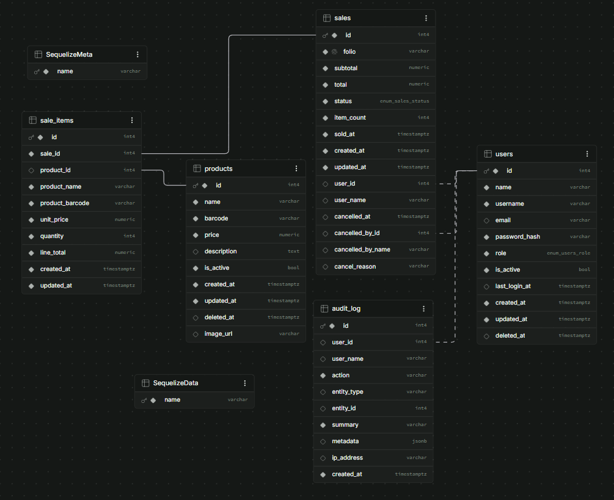

# Innova POS — API

API REST del punto de venta. Node.js + Express + Sequelize sobre PostgreSQL.

> Para la visión general del proyecto, el despliegue y la puesta en marcha
> conjunta, ver el [README de la raíz](../README.md). Para las decisiones de
> arquitectura y el registro de errores resueltos, [CLAUDE.md](../CLAUDE.md).

---

## Índice

- [Puesta en marcha](#puesta-en-marcha)
- [Estructura](#estructura)
- [Modelo de datos](#modelo-de-datos)
- [Seguridad](#seguridad)
- [Dinero y precisión](#dinero-y-precisión)
- [Zona horaria](#zona-horaria)
- [Endpoints](#endpoints)
- [Semillas](#semillas)
- [Pruebas](#pruebas)
- [Comandos](#comandos)

---

## Puesta en marcha

```bash
cp .env.example .env
npm install
npm run db:setup     # crea la base, migra y siembra datos de demostración
npm run dev          # http://localhost:3000/api
```

Requiere Node 18 o superior y un PostgreSQL accesible. El `docker-compose.yml`
de la raíz levanta uno con `docker compose up -d db`.

Comprobación rápida:

```bash
curl http://localhost:3000/api/health
```

---

## Estructura

Capas con una responsabilidad cada una. **La lógica de negocio vive en
`services/`**: los controladores solo traducen HTTP y los modelos solo definen
la forma de los datos.

```
src/
├── config/          Configuración, matriz de permisos, conexión
│   ├── index.js         Variables de entorno validadas
│   ├── database.js      Configuración de Sequelize (y sequelize-cli)
│   └── roles.js         Única fuente de verdad de los permisos
├── controllers/     Traducen petición ↔ servicio. Sin lógica de negocio
├── services/        Lógica de negocio y transacciones
├── models/          Definición Sequelize, hooks y scopes
├── validators/      Reglas de express-validator por endpoint
├── middlewares/     authenticate · authorize · validate · errorHandler · notFound
├── routes/          Montaje y declaración del permiso de cada ruta
├── utils/           ApiError · asyncHandler · money · ean13
└── database/        migrations/ y seeders/
```

**54 archivos, ~4 250 líneas.**

### Formato de respuesta

Uniforme en toda la API, para que el cliente no tenga que adivinar:

```jsonc
// Éxito
{ "success": true, "data": { ... }, "meta": { "total": 15, "limit": 20, "offset": 0 } }

// Error
{ "success": false, "error": { "message": "...", "details": [ ... ] } }
```

---

## Modelo de datos



| Tabla | Contiene |
|---|---|
| `products` | Catálogo. Baja lógica con `deleted_at` |
| `sales` | Cabecera: folio, totales, estado, cajero, datos de anulación |
| `sale_items` | Renglones, **con copia del producto** |
| `users` | Cuentas, rol y `password_hash` |
| `audit_log` | Bitácora inmutable de acciones |

### La decisión que más importa

`sale_items` guarda `product_name`, `product_barcode` y `unit_price` **copiados
en el momento de la venta**, no solo `product_id`.

Un ticket de hace tres meses debe mostrar lo que se cobró entonces. Si el
renglón se limitara a apuntar al producto, subir un precio reescribiría el
historial completo y los reportes dejarían de cuadrar con lo que el cliente
pagó.

De ahí las claves foráneas:

| Relación | Regla | Motivo |
|---|---|---|
| `sale_items.sale_id` → `sales` | `CASCADE` | Un renglón sin venta no significa nada |
| `sale_items.product_id` → `products` | `SET NULL` | Se puede dar de baja un producto sin perder las ventas |
| `sales.user_id` → `users` | `SET NULL` | Un empleado que se va no borra su rastro |
| `audit_log.user_id` → `users` | `SET NULL` | Igual, más copia del nombre |

### Folio

Se obtiene de una secuencia de PostgreSQL (`nextval`), no de un `COUNT(*)`.
`nextval` es atómico; contar filas produce folios duplicados en cuanto dos cajas
cobran a la vez.

### Creación de una venta

Todo dentro de una transacción: cabecera, renglones y bitácora. Si algo falla,
no queda media venta.

---

## Seguridad

### Contraseñas

**bcryptjs, 10 rondas.** Se eligió `bcryptjs` sobre `bcrypt` porque es JS puro y
no requiere compilación nativa, lo que evita fallos de instalación según el
entorno.

- El hash **no sale de la base**: el `defaultScope` del modelo lo excluye y
  `toJSON()` lo elimina. Hay que pedirlo explícitamente con un scope.
- Longitud **mínima 12, máxima 72 bytes**. El tope no es arbitrario: bcrypt
  trunca en 72 y permitir más daría una falsa sensación de seguridad, porque los
  caracteres sobrantes se ignorarían sin avisar.

### Inicio de sesión

Usuario inexistente, contraseña incorrecta y cuenta desactivada devuelven
**exactamente la misma respuesta**. Distinguirlas permitiría enumerar usuarios.

Además, cuando el usuario no existe se ejecuta igualmente un hash ficticio:

```js
// Se compara igualmente contra un hash ficticio para que la respuesta tarde
// lo mismo y el tiempo no delate qué usuarios existen.
await User.hashPassword(String(password || ''));
```

Sin eso, «no existe» responde al instante y «contraseña incorrecta» tarda los
~100 ms de bcrypt: la diferencia es medible y revela cuentas reales.

### Tokens

**JWT HS256**, vigencia de **8 horas** —un turno de caja—, con `issuer`
verificado.

Dos decisiones deliberadas:

1. **Los permisos no viajan dentro del token.** Se derivan del rol en cada
   petición, así un cambio en la matriz surte efecto de inmediato en lugar de
   esperar a que caduquen los tokens ya emitidos.
2. **El usuario se relee de la base en cada petición.** Desactivar una cuenta o
   cambiarle el rol tiene efecto en la siguiente llamada, no en ocho horas.

`JWT_SECRET` es obligatorio en producción, con mínimo 32 caracteres. **El
proceso se niega a arrancar sin él**: hacerlo con un valor por defecto conocido
equivaldría a no tener autenticación, porque cualquiera podría fabricar tokens
válidos.

```bash
node -e "console.log(require('crypto').randomBytes(48).toString('hex'))"
```

### Autorización

`config/roles.js` es la **única fuente de verdad**. Cada ruta declara el permiso
que exige:

```js
router.post('/:id/cancel', authorize(PERMISSIONS.SALES_CANCEL), ...);
```

| Permiso | Admin | Supervisor | Cajero |
|---|:--:|:--:|:--:|
| `products.view` | ✔ | ✔ | ✔ |
| `products.manage` | ✔ | ✔ | — |
| `sales.create` | ✔ | ✔ | ✔ |
| `sales.view` | ✔ | ✔ | solo las propias |
| `sales.cancel` | ✔ | ✔ | — |
| `dashboard.view` | ✔ | ✔ | — |
| `reports.view` | ✔ | ✔ | — |
| `users.manage` | ✔ | — | — |
| `audit.view` | ✔ | — | — |

### Transporte

- **helmet** en toda la API.
- **CORS con lista blanca** por `CORS_ORIGIN`, admite varios orígenes separados
  por coma. Firebase publica el mismo sitio en `.web.app` y `.firebaseapp.com`:
  van los dos, o el no declarado falla con un error que en el navegador se lee
  como «la API no responde».
- **TLS obligatorio hacia la base** cuando se usa `DATABASE_URL`. La conexión
  cruza Internet; sin cifrar viajarían en claro la contraseña y las ventas.

### Bitácora

`audit_log` es **inmutable** (`updatedAt: false`), y registrar una entrada
**nunca propaga una excepción**: una venta no puede perderse porque falló la
escritura del registro de auditoría.

---

## Dinero y precisión

`DECIMAL(10,2)` en la base, con `decimalNumbers: false` para que Sequelize
devuelva cadenas. Los importes **viajan como cadena** y la aritmética se hace en
**centavos enteros** (`utils/money.js`). Nunca en coma flotante.

`parseDecimalString` analiza los dígitos directamente en lugar de usar
`Number()`:

```js
Number('1.005')  // 1.00499999999999989  → redondea a 1.00 en vez de 1.01
```

Un centavo por venta parece nada hasta que son seiscientas ventas y el corte no
cuadra.

La validación **rechaza más de dos decimales** en lugar de redondear en
silencio. Antes `2.99999` se guardaba como `3.00` sin que nadie se enterara.

---

## Zona horaria

Las marcas de tiempo se guardan en UTC, pero **toda agregación se hace en la
zona del negocio**:

```sql
(sold_at AT TIME ZONE 'America/El_Salvador')
```

```js
new Intl.DateTimeFormat('en-CA', { timeZone }).format(new Date())  // "hoy" local
```

Un reporte por hora responde «¿a qué hora vendió la tienda?», no «¿a qué hora
fue en Greenwich?». Agregar sin convertir desplaza la curva seis horas y coloca
el pico de la tarde en la madrugada.

El Salvador es UTC−6 todo el año, sin horario de verano, así que la conversión
es constante. Configurable con `BUSINESS_TIMEZONE`.

---

## Endpoints

Todos bajo `/api`. Todos requieren token salvo `/health` y `/auth/login`.

### Sesión

| Método | Ruta | Descripción |
|---|---|---|
| `GET` | `/health` | Sonda pública, no toca la base |
| `POST` | `/auth/login` | Devuelve token, usuario y permisos |
| `POST` | `/auth/logout` | Registra el cierre en la bitácora |
| `GET` | `/auth/me` | Revalida el token y devuelve la sesión |
| `GET` | `/auth/roles` | Roles con la descripción de sus permisos |
| `POST` | `/auth/change-password` | Cambio de la propia contraseña |

### Productos

| Método | Ruta | Permiso |
|---|---|---|
| `GET` | `/products` | `products.view` |
| `GET` | `/products/:id` | `products.view` |
| `GET` | `/products/barcode/:barcode` | `products.view` |
| `POST` | `/products` | `products.manage` |
| `PUT` | `/products/:id` | `products.manage` |
| `DELETE` | `/products/:id` | `products.manage` (baja lógica) |

La búsqueda de `/products` acepta `search`, que consulta **nombre o código de
barras** y ordena por relevancia: coincidencia exacta de código primero, luego
nombre que empieza igual, luego el resto.

### Ventas

| Método | Ruta | Permiso |
|---|---|---|
| `GET` | `/sales` | `sales.view` — filtros: `folio`, `from`, `to`, `userId`, `status` |
| `GET` | `/sales/:id` | `sales.view` — incluye renglones |
| `POST` | `/sales` | `sales.create` |
| `POST` | `/sales/:id/cancel` | `sales.cancel` — exige motivo |

### Análisis

| Método | Ruta | Permiso |
|---|---|---|
| `GET` | `/dashboard` | `dashboard.view` |
| `GET` | `/reports/sales` | `reports.view` |
| `GET` | `/reports/sales.csv` | `reports.view` |
| `GET` | `/reports/products.csv` | `reports.view` |

### Administración

| Método | Ruta | Permiso |
|---|---|---|
| `GET` `POST` `PUT` `DELETE` | `/users` `/users/:id` | `users.manage` |
| `GET` | `/audit` `/audit/:id` | `audit.view` |

Detalle completo de parámetros y respuestas en [`docs/API.md`](../docs/API.md).

---

## Semillas

Dos juegos, **no intercambiables**.

### Demostración — `npm run db:seed`

15 productos, 3 usuarios y 30 días de historial (600 ventas, 1 410 renglones,
699 entradas de bitácora).

El historial se genera de forma **determinista**: la misma semilla produce
siempre el mismo resultado, de modo que dos personas vean lo mismo y cualquier
captura siga siendo válida. Se simula una tienda real, no números al azar:
curva de dos picos (mañana y tarde), más ventas en fin de semana, distribución
desigual de productos y reparto entre cajeros.

Los códigos de barras se declaran con **doce dígitos** y el verificador lo
calcula el seeder. Escribirlo a mano garantiza equivocarse, y un verificador
incorrecto deja el código sin representación gráfica e ilegible para un lector.

**Se niegan a ejecutarse con `NODE_ENV=production`**: insertarían historial
falso que descuadraría los reportes de un negocio real y crearían cuentas cuya
contraseña está publicada en el repositorio. Salida explícita para entornos de
capacitación: `ALLOW_DEMO_SEED=yes-i-know`.

### Producción — `npm run db:seed:prod`

Crea **un solo administrador**, nada más. La contraseña se toma de
`INITIAL_ADMIN_PASSWORD` o se genera al azar y se imprime **una única vez**:

```
┌───────────────────────────────────────────────────────────┐
│  ADMINISTRADOR INICIAL CREADO                             │
├───────────────────────────────────────────────────────────┤
│  Usuario:     admin                                       │
│  Contraseña:  JEx75-Gcf89-a4KyS-wG6VY                     │
└───────────────────────────────────────────────────────────┘
```

El formato en bloques es deliberado: un volcado hexadecimal de 32 caracteres se
teclea mal y acaba anotado en un papel.

Reejecutarlo **no** crea un segundo administrador ni restablece la contraseña
del que ya está en uso.

Las semillas quedan registradas en `SequelizeData` (`seederStorage: 'sequelize'`),
así que reiniciar no duplica el catálogo.

---

## Pruebas

**180 pruebas** en 8 suites, con Jest y una base propia que se crea y limpia
sola.

```bash
npm test
npm run test:coverage
```

Cubren, entre otras cosas:

- Aritmética en centavos y los casos límite de coma flotante.
- Dígito verificador EAN-13, incluyendo **el propio seeder** ejecutado contra un
  `queryInterface` falso: la corrección de los códigos se verifica, no se supone.
- Permisos por rol en cada endpoint.
- Creación transaccional de ventas y unicidad de folios.
- Conversión de zona horaria en las agregaciones.

La configuración `test` **no incluye `DATABASE_URL`**, de modo que la suite no
puede truncar tablas en producción aunque la variable esté definida.
Comprobado ejecutándola con ella puesta.

---

## Comandos

| Comando | Descripción |
|---|---|
| `npm run dev` | Servidor con recarga automática |
| `npm start` | Servidor en producción |
| `npm run db:setup` | Crear base + migrar + sembrar demostración |
| `npm run db:setup:prod` | Migrar + administrador inicial |
| `npm run db:migrate` | Aplicar migraciones pendientes |
| `npm run db:seed` | Sembrar datos de demostración |
| `npm run db:seed:prod` | Crear el administrador inicial |
| `npm run db:reset` | Revertir, migrar y sembrar de nuevo |
| `npm test` | Suite completa |
| `npm run lint` | ESLint |

### Variables de entorno

Documentadas en [`.env.example`](.env.example). Las que importan:

| Variable | Notas |
|---|---|
| `JWT_SECRET` | **Obligatoria en producción**, mínimo 32 caracteres |
| `DATABASE_URL` | Si está, manda sobre `DB_HOST`/etc. y activa TLS |
| `CORS_ORIGIN` | Lista separada por comas |
| `BUSINESS_TIMEZONE` | Por defecto `America/El_Salvador` |
| `INITIAL_ADMIN_PASSWORD` | Solo para `db:seed:prod`; si falta, se genera |

Con Supabase hay que usar el **Session pooler** (puerto 5432). El host directo
`db.<ref>.supabase.co` solo resuelve a IPv6 y falla desde cualquier red sin
salida IPv6 —incluido el plan gratuito de Render—; el *Transaction pooler*
(6543) no admite sentencias preparadas y rompe las migraciones.
