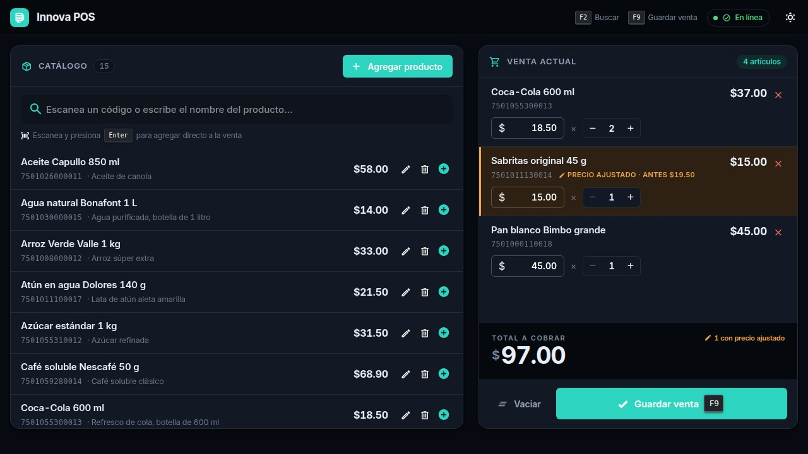
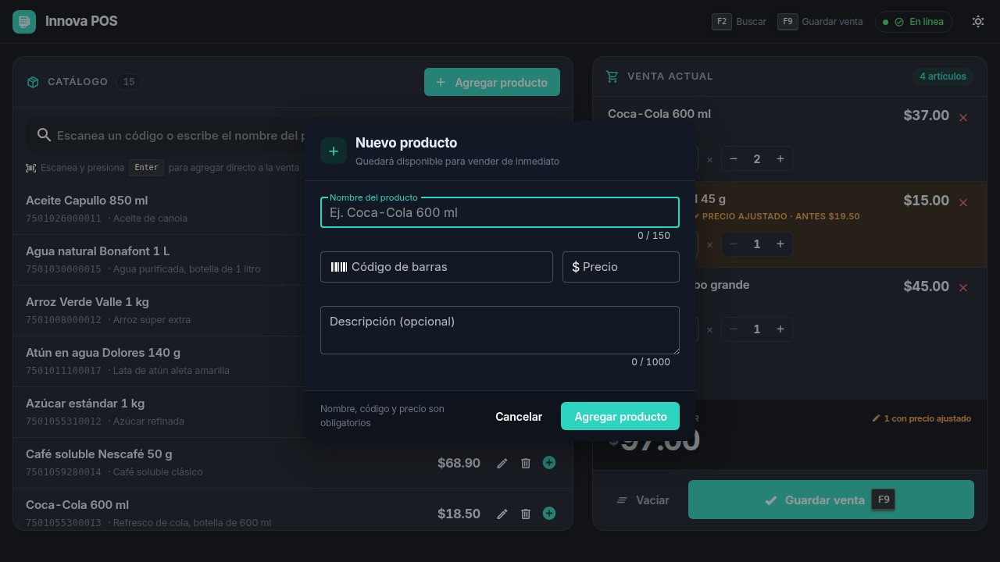

# Sistema de diseño — Innova POS

Dirección visual: **"Terminal de trabajo"**.

No un panel de administración genérico ni una aplicación de consumo: un instrumento
que alguien usa cientos de veces al día, con un cliente esperando enfrente.


---

## Las tres decisiones que definen el diseño

### 1. El total vive en una losa oscura

Es el único elemento de toda la pantalla con ese tratamiento. Sin competencia visual,
la mirada cae ahí sin buscarlo. No es decoración: es la cifra que el cajero dice en voz
alta, y debe leerse desde dos metros de distancia.

Se compone en 46 px, peso 700, con cifras tabulares y el símbolo de moneda reducido y
elevado, para que los dígitos —lo que importa— dominen ópticamente.

### 2. Un color, un significado

| Color | Uso | Nunca se usa para |
|-------|-----|-------------------|
| Teal `#0F766E` | Acciones primarias, elementos activos | Estados de error o advertencia |
| Ámbar `#B45309` | **Exclusivamente** precio ajustado dentro de la venta | Cualquier otra advertencia |
| Rojo `#B3261E` | Acciones destructivas y errores | Énfasis decorativo |

El ámbar está reservado. Si apareciera en otros contextos, dejaría de significar "aquí
alguien cambió el precio" y el indicador perdería su valor.

### 3. Tipografía Inter con cifras tabulares

Roboto por defecto es lo que hace que una interfaz Vuetify se reconozca al instante
como plantilla. Inter aporta carácter propio y, sobre todo, cifras de ancho fijo
(`font-variant-numeric: tabular-nums`): sin ellas los precios bailan de fila en fila y
la columna deja de leerse como columna.

Se auto-hospeda con `@fontsource/inter` — sin CDN, funciona sin conexión.

---

## Precio ajustado dentro de la venta

El requisito permite editar el precio en la venta sin tocar el catálogo. Confundir
ambos cuesta dinero, así que el renglón ajustado se señala con **cuatro indicadores
simultáneos**:

1. Franja ámbar en el borde izquierdo
2. Fondo teñido
3. Etiqueta `PRECIO AJUSTADO · ANTES $19.50` con el valor original
4. Contador en la losa del total: `1 con precio ajustado`

Son redundantes a propósito. Comunicar solo con color deja fuera a quien tiene
daltonismo, y en un POS ese dato no es cosmético.

---

## Modo oscuro

Muchos comercios operan de noche con poca luz ambiental; forzar el tema claro deslumbra.
El tema arranca según la preferencia del sistema y recuerda la elección del usuario.



---

## Teclado primero

El flujo completo de una venta se hace sin soltar el teclado:

| Tecla | Acción |
|-------|--------|
| `F2` | Enfocar el buscador |
| `Enter` | Agregar el producto escaneado a la venta |
| `F9` | Guardar la venta |
| `Esc` | Cerrar el diálogo abierto |

Los atajos se muestran en la barra superior y sobre el botón de guardar: se aprenden
usándolos, sin manual.

El foco visible usa un contorno de 2 px en color primario, nunca se suprime.

---

## Diálogos



Cabecera con icono contextual, subtítulo que aclara la consecuencia de la acción
("Los cambios no afectan las ventas ya registradas"), y pie con recordatorio de los
campos obligatorios. Los errores del servidor se pintan en su campo correspondiente; el
diálogo permanece abierto para corregir sin reescribir todo.

---

## Tokens

Definidos como variables CSS en `src/styles/design-system.css`, con valores propios para
cada tema.

```
--pos-bg              Fondo de la aplicación
--pos-surface         Fondo de paneles y diálogos
--pos-surface-sunken  Fondo hundido (buscador, pies)
--pos-border          Separadores
--pos-ink             Barra superior y losa del total
--pos-text            Texto principal
--pos-text-muted      Texto secundario
--pos-text-faint      Metadatos
--pos-primary         Acciones primarias
--pos-accent          Precio ajustado (reservado)
--pos-danger          Acciones destructivas
```

La paleta de Vuetify se configura en `src/plugins/vuetify.js` para que los componentes
de la librería usen los mismos colores que el CSS propio.

---

## Accesibilidad

- Contraste **AA** de WCAG como mínimo en todos los pares texto/fondo; la cifra del
  total alcanza **AAA**.
- Ningún estado se comunica solo con color: siempre acompañado de icono, etiqueta o
  forma.
- Áreas táctiles de **44 × 44 px** en dispositivos de puntero grueso (`pointer: coarse`).
- El control de cantidad es una pieza única en lugar de botones sueltos, para que no se
  pulse por error el de al lado.
- Se respeta `prefers-reduced-motion`.

---

## Restricción respetada

Todo está construido con **Vuetify 2 sobre Vue 2**, sin componentes de terceros ni
reescrituras de la librería. Lo que cambia es el tema, la tipografía, la densidad, la
jerarquía y el CSS propio — lo suficiente para que no se reconozca como plantilla, sin
salirse del stack que exige la prueba.
